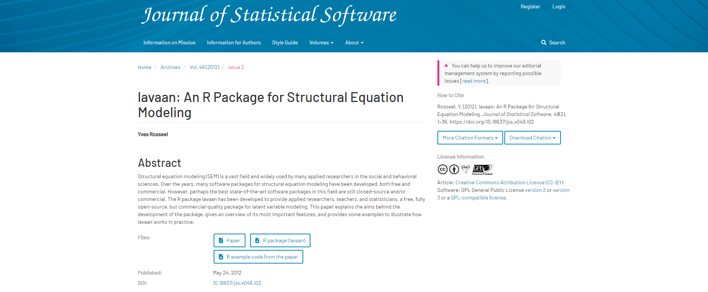

```{r setup, include=FALSE, echo=FALSE}
options(htmltools.dir.version = FALSE)
library(xaringan)
library(xaringanExtra)
library(data.table)
library(lavaan)
library(kableExtra)
library(RefManageR)

here::i_am("docs/index.Rmd")

xaringanExtra::use_panelset()

BibOptions(check.entries = FALSE, bib.style = "authoryear", style = "markdown", dashed = TRUE)
bib <- ReadBib("./assets/bib.bib", check = FALSE) 
ui <- "- "
```

# Contenidos

### 1. Modelo básico

### 2. Estimación

### 3. Modelos anidados

### 4. Interpretación

### 5. Referencias

---

class: inverse, center, middle

# Modelo

---

# Modelo

[Estudio Longitudinal Social de Chile](https://dataverse.harvard.edu/dataverse/elsoc) (ELSOC). 5 Olas: 2016, 2017, 2018, 2019, 2021

```{r f1modelo, echo=FALSE, fig.align='center', fig.asp=.75, fig.cap='ELSOC en Harvard Dataverse', out.width='100%'}
knitr::include_graphics("assets/1_dataverse.png")
```

`r NoCite(bib, title = "DVN/LQMURF_2022")`

???

---

# Modelo

Chayinska, Miranda & Gonzalez (2021). A longitudinal study of the bidirectional causal relationships between online political participation and offline collective action. 

```{r f2modelo, echo=FALSE, fig.align='center', fig.asp=.75, fig.cap='Chayinska, Miranda & Gonzalez (2021)', out.width='60%'}

```

`r NoCite(bib, title = "CHAYINSKA2021106810")`

???

---

# Modelo

Con datos de ELSOC 2016-2021, replicaremos los resultados de Chayinska, Miranda & Gonzalez (2021).

Las medidas que utilizaremos son las siguientes:

- **Participación política on-line**: 

    "Durante los últimos 12 meses, ¿con cuánta frecuencia usted ha... Usado las redes sociales para expresar su opinión en temas públicos?"
   
    1 = nunca a 5 = muy frecuentemente.

- **Participación off-line en acciones colectivas**: 

    "Durante los últimos 12 meses, ¿con cuánta frecuencia usted ha... Asistido a una marcha o manifestación política?"
   
    1 = nunca a 5 = muy frecuentemente.
   

???

---

# Modelo
.pull-leftadd[
```{r f3modelo, echo=FALSE, fig.align='left', fig.asp=.75, fig.cap='RI-CLPM conceptual de las asociaciones entre Participación Offline y Participación On-line', out.width='90%'}

```
]

.pull-rightadd[ 
$OFF_{it}$: **Puntajes observados** en participación off-line para el individuo $i$ en la ola $t$.

$ON_{it}$: **Puntajes observados** en participación online para el individuo $i$ en la ola $t$.
]

???

---

# Modelo
.pull-leftadd[
```{r f4modelo, echo=FALSE, fig.align='left', fig.asp=.75, fig.cap='RI-CLPM conceptual de las asociaciones entre Participación Offline y Participación On-line', out.width='90%'}

```
]

.pull-rightadd[ 
$RI_{OFFi}$: **Intercepto aleatorio** de participación off-line para el individuo $i$.

$RI_{ONi}$: **Intercepto aleatorio** de participación online para el individuo $i$.

Los interceptos aleatorios representan el componente **between**: son las desviaciones del individuo $i$, en términos de su puntaje esperado, respecto a la gran media de cada variable.
]

???

---

# Modelo
.pull-leftadd[
```{r f5modelo, echo=FALSE, fig.align='left', fig.asp=.75, fig.cap='RI-CLPM conceptual de las asociaciones entre Participación Offline y Participación On-line', out.width='90%'}

```
]

.pull-rightadd[ 
$OFF^{*}_{it}$: Desviaciones temporales en $t$ del individuo $i$ respecto a sus puntajes esperados en participación off-line.

$ON^{*}_{it}$: Desviaciones temporales en $t$ del individuo $i$ respecto a sus puntajes esperados en participación online.

Constituyen las **fluctuaciones intra-persona**, el componente _within_.
]

???

---

# Modelo
.pull-leftadd[
```{r f6modelo, echo=FALSE, fig.align='left', fig.asp=.75, fig.cap='RI-CLPM conceptual de las asociaciones entre Participación Offline y Participación On-line', out.width='90%'}

```
]

.pull-rightadd[ 
$OFF^{*}_{i1}$ y $ON^{*}_{i1}$ son modelados como variables exógenas. 

Supuesto: los componentes _within_ están correlacionados entre si en cada $t$. 

$u_{it}$ y $v_{it}$ son los residuos. 

Supuesto: los residuos $u_{it}$ y $v_{it}$ están normalmente distribuidos y correlacionados entre sí, dentro de cada tiempo $t \geq 2$.

]

???

---

class: inverse, center, middle

# Estimacion

---

# Estimacion 

Yves Rosseel (2012). lavaan: An R Package for Structural Equation Modeling.

```{r f1estimacion, echo=FALSE, fig.align='center', fig.asp=.75, fig.cap='Paper de lavaan', out.width='90%'}

```

`r NoCite(bib, title = "JSSv048i02")`

---

# Estimacion

En R, los RI-CLPM pueden ser estimados con la librería `lavaan` (Rosseel,2012).

Sintaxis de modelo de `lavaan` y sus tipos de fórmula:

</br>
</br>

```{r echo=FALSE, results='asis'}
knitr::kable(data.frame(`Tipo` = c("Definición de variable latente",
                                              "Regresión",
                                              "(co)varianza (residual)",
                                              "Intercepto"),
                        `Operador` = c("=~","~","~~","~ 1"),
                        `Mnemotecnia` = c("es medido por",
                                          "es predecido por",
                                          "está correlacionado con",
                                          "intercepto")),
             format = "html", table.attr = "style='font-size: 22px;'")
```

???

---

# Estimacion

La sintaxis de modelo de `lavaan` está constituida por una combinación de tipos de fórmula, cerrada por comillas simples. Ejemplo:

```{r eval=FALSE, include=TRUE}
modelo <- ' 
             # regresiones
             y1 + y2 ~ f1 + f2 + x1 + x2
                  f1 ~ f2 + f3
                  f2 ~ f3 + x1 + x2
             # variables latentes
               f1 =~ y1 + y2 + y3 
               f2 =~ y4 + y5 + y6 
               f3 =~ y7 + y8 + y9 + y10
             # varianzas y covarianzas 
               y1 ~~ y1 
               y1 ~~ y2 
               f1 ~~ f2
             # interceptos 
               y1 ~ 1 
               f1 ~ 1
          '     
```

---

# Estimacion

Previo: Preparar los datos.

.small2[
```{r prepare data, echo=TRUE}
# Data
load(url("https://dataverse.harvard.edu/api/access/datafile/6160173"))
setDT(elsoc_long_2016_2021)

# Long to wide
elsoc <- dcast(elsoc_long_2016_2021, idencuesta ~ ola, value.var = c("c08_02","c08_04","m0_edad","m01","m0_sexo"))

# Select variables
old <- c("idencuesta",paste0("c08_02_",1:5),paste0("c08_04_",1:5),"m0_edad_1","m01_1","m0_sexo_1")
new <- c("id",paste0("off",1:5),paste0("onl",1:5),"edad","educ","sexo")
setnames(elsoc,old,new)
elsoc <- elsoc[, ..new]

# Recode NAs
elsoc <- elsoc[, lapply(.SD, function(x) replace(x, which(x %in% c(-666,-888,-999)), NA))]

# Cleaning workspace
rm(elsoc_long_2016_2021,old,new)
elsoc <- as.data.frame(elsoc)
```
]

---

# Estimacion

.small2[
```{r echo=TRUE, results='asis'}
summarytools::descr(elsoc[-1], order="p", stats = "common", transpose = T, style = "rmarkdown", headings = F)
```
] 

---

# Estimacion

La especificación del RI-CLPM cuenta con 4 partes:

1. Componente _between_, los interceptos aleatorios. 

2. Componente _within_, fluctuaciones intra-individuos. 

3. Las regresiones entre los componentes _within_.

4. Covarianzas relevantes en los componentes _between_ y _within_.

---

# Estimacion

.pull-leftadd[
```{r f2estimacion, echo=FALSE, fig.align='left', fig.asp=.75, fig.cap='RI-CLPM conceptual de las asociaciones entre Participación Offline y Participación On-line', out.width='90%'}

```
]

.pull-rightadd[ 

#### 1. Componente _between_, los interceptos aleatorios. 

Variables latentes, con las medidas repetidas en $t$ como indicadores. 

Cargas factoriales fijadas en 1. 

Supuestos: 

- Los interceptos aleatorios tienen igual influencia en cada ocasión. 

- Los interceptos aleatorios están correlacionados entre si. 

]


???

Los interceptos aleatorios son especificados creando variables latentes, con las medidas repetidas en $t$ como indicadores. Las cargas factoriales son fijadas en 1 porque RI-CLPM se basa en el supuesto de que los interceptos aleatorios tienen igual influencia en cada ocasión. Se asume que los interceptos aleatorios están correlacionados entre si. 

---

# Estimacion

.small2[
.panelset.sideways[

.panel[.panel-name[Componente between, los interceptos aleatorios.]
```{r echo=TRUE}
between <- ' 
             # Crear los componentes between
             RI_x =~ 1*off1 + 1*off2 + 1*off3 + 1*off4 + 1*off5
             RI_y =~ 1*onl1 + 1*onl2 + 1*onl3 + 1*onl4 + 1*onl5
           '

```
] ] ]


???

---

# Estimacion

.pull-leftadd[
```{r f3estimacion, echo=FALSE, fig.align='left', fig.asp=.75, fig.cap='RI-CLPM conceptual de las asociaciones entre Participación Offline y Participación On-line', out.width='90%'}

```
]

.pull-rightadd[ 

#### 2. Componente _within_, fluctuaciones intra-individuos. 

Variables latentes, explicadas por sus respectivas medidas observadas en cada ocasión.

]


???

---

# Estimacion

.small2[
.panelset.sideways[

.panel[.panel-name[Componente within, fluctuaciones intra-individuos.]
```{r echo=TRUE}
within  <- '
             # Crear los componentes within
             cx1 =~ 1*off1
             cx2 =~ 1*off2
             cx3 =~ 1*off3
             cx4 =~ 1*off4
             cx5 =~ 1*off5
             cy1 =~ 1*onl1
             cy2 =~ 1*onl2
             cy3 =~ 1*onl3
             cy4 =~ 1*onl4
             cy5 =~ 1*onl5
             
             # Constrenir las varianzas del error de medicion a cero
             off1 ~~ 0*off1
             off2 ~~ 0*off2
             off3 ~~ 0*off3
             off4 ~~ 0*off4
             off5 ~~ 0*off5
             onl1 ~~ 0*onl1
             onl2 ~~ 0*onl2
             onl3 ~~ 0*onl3
             onl4 ~~ 0*onl4
             onl5 ~~ 0*onl5
          '

```
]

.panel[.panel-name[Componente between, los interceptos aleatorios.]
```{r echo=TRUE}
between <- ' 
             # Crear los componentes between
             RI_x =~ 1*off1 + 1*off2 + 1*off3 + 1*off4 + 1*off5
             RI_y =~ 1*onl1 + 1*onl2 + 1*onl3 + 1*onl4 + 1*onl5
           '

```
] ] ]


???

Se constriñen las varianzas del error de medición a cero, no hay error de medición.

---

# Estimacion

.pull-leftadd[
```{r f4estimacion, echo=FALSE, fig.align='left', fig.asp=.75, fig.cap='RI-CLPM conceptual de las asociaciones entre Participación Offline y Participación On-line', out.width='90%'}

```
]

.pull-rightadd[ 

#### 3. Las regresiones entre los componentes _within_.

Efectos lagged autorregresivos y crosslagged.

]

---

# Estimacion

.small2[
.panelset.sideways[

.panel[.panel-name[Las regresiones entre los componentes _within_.]
```{r echo=TRUE}
efectos  <- '
              # Estimar los efectos lagged
               cx2 ~ cx1 + cy1
               cx3 ~ cx2 + cy2
               cx4 ~ cx3 + cy3
               cx5 ~ cx4 + cy4
               cy2 ~ cx1 + cy1
               cy3 ~ cx2 + cy2
               cy4 ~ cx3 + cy3
               cy5 ~ cx4 + cy4
           '

```
] 

.panel[.panel-name[Componente within, fluctuaciones intra-individuos.]
```{r echo=TRUE}
within  <- '
             # Crear los componentes within
             cx1 =~ 1*off1
             cx2 =~ 1*off2
             cx3 =~ 1*off3
             cx4 =~ 1*off4
             cx5 =~ 1*off5
             cy1 =~ 1*onl1
             cy2 =~ 1*onl2
             cy3 =~ 1*onl3
             cy4 =~ 1*onl4
             cy5 =~ 1*onl5
             
             # Constrenir las varianzas del error de medicion a cero
             off1 ~~ 0*off1
             off2 ~~ 0*off2
             off3 ~~ 0*off3
             off4 ~~ 0*off4
             off5 ~~ 0*off5
             onl1 ~~ 0*onl1
             onl2 ~~ 0*onl2
             onl3 ~~ 0*onl3
             onl4 ~~ 0*onl4
             onl5 ~~ 0*onl5
          '

```
]

.panel[.panel-name[Componente between, los interceptos aleatorios.]
```{r echo=TRUE}
between <- ' 
             # Crear los componentes between
             RI_x =~ 1*off1 + 1*off2 + 1*off3 + 1*off4 + 1*off5
             RI_y =~ 1*onl1 + 1*onl2 + 1*onl3 + 1*onl4 + 1*onl5
           '

```
] ] ]

???

---

# Estimacion

.pull-leftadd[
```{r f5estimacion, echo=FALSE, fig.align='left', fig.asp=.75, fig.cap='RI-CLPM conceptual de las asociaciones entre Participación Offline y Participación On-line', out.width='90%'}

```
]

.pull-rightadd[ 

#### 4. Covarianzas relevantes en los componentes _between_ y _within_.

Los componentes within estén correlacionados en cada $t$, tanto en la primera ola (exógena) como sus residuos desde la ola 2.

]

---

# Estimacion

.small2[

.panelset.sideways[

.panel[.panel-name[Covarianzas relevantes en los componentes between y within (I)]
```{r echo=TRUE}
covarianza1  <- '
                 # Estimar la covarianza entre los componentes within t=1
                 cx1 ~~ cy1
                 
                 # Estimar las covarianzas entre los residuos del componente within
                 cx2 ~~ cy2
                 cx3 ~~ cy3
                 cx4 ~~ cy4
                 cx5 ~~ cy5
              '
```
] 


.panel[.panel-name[Las regresiones entre los componentes _within_.]
```{r echo=TRUE}
efectos  <- '
              # Estimar los efectos lagged
               cx2 ~ cx1 + cy1
               cx3 ~ cx2 + cy2
               cx4 ~ cx3 + cy3
               cx5 ~ cx4 + cy4
               cy2 ~ cx1 + cy1
               cy3 ~ cx2 + cy2
               cy4 ~ cx3 + cy3
               cy5 ~ cx4 + cy4
           '

```
] 

.panel[.panel-name[Componente within, fluctuaciones intra-individuos.]
```{r echo=TRUE}
within  <- '
             # Crear los componentes within
             cx1 =~ 1*off1
             cx2 =~ 1*off2
             cx3 =~ 1*off3
             cx4 =~ 1*off4
             cx5 =~ 1*off5
             cy1 =~ 1*onl1
             cy2 =~ 1*onl2
             cy3 =~ 1*onl3
             cy4 =~ 1*onl4
             cy5 =~ 1*onl5
             
             # Constrenir las varianzas del error de medicion a cero
             off1 ~~ 0*off1
             off2 ~~ 0*off2
             off3 ~~ 0*off3
             off4 ~~ 0*off4
             off5 ~~ 0*off5
             onl1 ~~ 0*onl1
             onl2 ~~ 0*onl2
             onl3 ~~ 0*onl3
             onl4 ~~ 0*onl4
             onl5 ~~ 0*onl5
          '

```
]

.panel[.panel-name[Componente between, los interceptos aleatorios.]
```{r echo=TRUE}
between <- ' 
             # Crear los componentes between
             RI_x =~ 1*off1 + 1*off2 + 1*off3 + 1*off4 + 1*off5
             RI_y =~ 1*onl1 + 1*onl2 + 1*onl3 + 1*onl4 + 1*onl5
           '

```
] ] ]


???

---

# Estimacion

.pull-leftadd[
```{r f6estimacion, echo=FALSE, fig.align='left', fig.asp=.75, fig.cap='RI-CLPM conceptual de las asociaciones entre Participación Offline y Participación On-line', out.width='90%'}

```
]

.pull-rightadd[ 

#### 4. Covarianzas relevantes en los componentes _between_ y _within_.

En el componente _between_, los interceptos aleatorios están correlacionados.

Los componentes _within_ en la primera ola y los interceptos aleatorios no están correlacionados. 

]

???

Las observaciones por lo general empiezan en un punto arbitrario del tiempo durante un proceso en desarrollo, por lo que no existen razones para asumir que están relacionados.

---


# Estimacion

.small2[

.panelset.sideways[

.panel[.panel-name[Covarianzas relevantes en los componentes between y within (II)]
```{r echo=TRUE}
covarianza2  <- '
                 # Estimar la varianza y covarianza entre los RI. 
                 RI_x ~~ RI_x
                 RI_y ~~ RI_y
                 RI_x ~~ RI_y
                  
                 # Fijar la correlacion entre los RI y componentes within t=1 a cero 
                 RI_x ~~ 0*cx1
                 RI_x ~~ 0*cy1
                 RI_y ~~ 0*cx1
                 RI_y ~~ 0*cy1
              '
```
] 


.panel[.panel-name[Covarianzas relevantes en los componentes between y within (I)]
```{r echo=TRUE}
covarianza1  <- '
                 # Estimar la covarianza entre los componentes within t=1
                 cx1 ~~ cy1
                 
                 # Estimar las covarianzas entre los residuos del componente within
                 cx2 ~~ cy2
                 cx3 ~~ cy3
                 cx4 ~~ cy4
                 cx5 ~~ cy5
              '
```
] 


.panel[.panel-name[Las regresiones entre los componentes _within_.]
```{r echo=TRUE}
efectos  <- '
              # Estimar los efectos lagged
               cx2 ~ cx1 + cy1
               cx3 ~ cx2 + cy2
               cx4 ~ cx3 + cy3
               cx5 ~ cx4 + cy4
               cy2 ~ cx1 + cy1
               cy3 ~ cx2 + cy2
               cy4 ~ cx3 + cy3
               cy5 ~ cx4 + cy4
           '

```
] 

.panel[.panel-name[Componente within, fluctuaciones intra-individuos.]
```{r echo=TRUE}
within  <- '
             # Crear los componentes within
             cx1 =~ 1*off1
             cx2 =~ 1*off2
             cx3 =~ 1*off3
             cx4 =~ 1*off4
             cx5 =~ 1*off5
             cy1 =~ 1*onl1
             cy2 =~ 1*onl2
             cy3 =~ 1*onl3
             cy4 =~ 1*onl4
             cy5 =~ 1*onl5
             
             # Constrenir las varianzas del error de medicion a cero
             off1 ~~ 0*off1
             off2 ~~ 0*off2
             off3 ~~ 0*off3
             off4 ~~ 0*off4
             off5 ~~ 0*off5
             onl1 ~~ 0*onl1
             onl2 ~~ 0*onl2
             onl3 ~~ 0*onl3
             onl4 ~~ 0*onl4
             onl5 ~~ 0*onl5
          '

```
]

.panel[.panel-name[Componente between, los interceptos aleatorios.]
```{r echo=TRUE}
between <- ' 
             # Crear los componentes between
             RI_x =~ 1*off1 + 1*off2 + 1*off3 + 1*off4 + 1*off5
             RI_y =~ 1*onl1 + 1*onl2 + 1*onl3 + 1*onl4 + 1*onl5
           '

```
] ] ]

???

---

# Estimacion

Modelo básico de RI-CLPM:

.small2[
```{r echo=TRUE}
modelo_lavaan <- '
    # Crear los componentes between
    RI_x =~ 1*off1 + 1*off2 + 1*off3 + 1*off4 + 1*off5
    RI_y =~ 1*onl1 + 1*onl2 + 1*onl3 + 1*onl4 + 1*onl5
    
    # Crear los componentes within
    cx1 =~ 1*off1
    cx2 =~ 1*off2
    cx3 =~ 1*off3
    cx4 =~ 1*off4
    cx5 =~ 1*off5
    
    cy1 =~ 1*onl1
    cy2 =~ 1*onl2
    cy3 =~ 1*onl3
    cy4 =~ 1*onl4
    cy5 =~ 1*onl5
    
    # Constrenir las varianzas del error de medicion a cero
    off1 ~~ 0*off1
    off2 ~~ 0*off2
    off3 ~~ 0*off3
    off4 ~~ 0*off4
    off5 ~~ 0*off5
    onl1 ~~ 0*onl1
    onl2 ~~ 0*onl2
    onl3 ~~ 0*onl3
    onl4 ~~ 0*onl4
    onl5 ~~ 0*onl5
    
    # Estimar los efectos lagged
    cx2 ~ cx1 + cy1
    cx3 ~ cx2 + cy2
    cx4 ~ cx3 + cy3
    cx5 ~ cx4 + cy4
    cy2 ~ cx1 + cy1
    cy3 ~ cx2 + cy2
    cy4 ~ cx3 + cy3
    cy5 ~ cx4 + cy4
    
    # Estimar la covarianza entre los componentes within t=1
    cx1 ~~ cy1
    
    # Estimar las covarianzas entre los residuos del componente within
    cx2 ~~ cy2
    cx3 ~~ cy3
    cx4 ~~ cy4
    cx5 ~~ cy5
    
    # Estimar las varianzas residuales del componente within
    cx1 ~~ cx1 # Varianzas
    cy1 ~~ cy1 
    cx2 ~~ cx2 # Varianzas residuales
    cy2 ~~ cy2 
    cx3 ~~ cx3 
    cy3 ~~ cy3 
    cx4 ~~ cx4 
    cy4 ~~ cy4 
    cx5 ~~ cx5
    cy5 ~~ cy5    
    
    # Estimar la varianza y covarianza entre los RI. 
    RI_x ~~ RI_x
    RI_y ~~ RI_y
    RI_x ~~ RI_y
    
    # Fijar la correlacion entre los RI y componentes within t=1 a cero 
    RI_x ~~ 0*cx1
    RI_x ~~ 0*cy1
    RI_y ~~ 0*cx1
    RI_y ~~ 0*cy1 
'
```
]

---

# Estimacion

Estimamos el objeto `modelo_lavaan` usando la función `lavaan( )`

```{r echo=TRUE, message=FALSE, warning=FALSE}
fit_lavaan <- lavaan(modelo_lavaan, data=elsoc, estimator = "MLR", missing = "FIML",
                     meanstructure = T, int.ov.free = T)
```

También es posible realizar la estimación a partir de varios objetos:

```{r message=FALSE, warning=FALSE, include=FALSE}
fit_lavaan2 <- lavaan(model = c(between, within, efectos, covarianza1, covarianza2),
                      data = elsoc, estimator = "MLR", missing = "FIML",
                      meanstructure = T, int.ov.free = T)
```

```{r eval=FALSE, message=FALSE, warning=FALSE, include=TRUE}
fit_lavaan2 <- lavaan(model = c(between, within, efectos, covarianza1, covarianza2),
                      data = elsoc, estimator = "MLR", missing = "FIML",
                      meanstructure = T, int.ov.free = T)
```

El estimador default de `lavaan` es maximum likelihood (`estimator = "ML"`), pero podemos especificar otros estimadores alternativos disponibles en `lavaan` (GLS, WLS, DWLS, ULS, DLS, PML, etc.). En este caso, usamos una estimación de maximum likelihood con errores estándar robustos (Huber-White) y estadísticos de prueba escalados (equivalentes a los estadísticos de prueba de Yuan-Bentler).

El comportamiento default de de `lavaan` frente a los valores perdidos es listwise deletion. Si los datos son MCAR (missing completely at random) o MAR (missing at random), podemos estimar caso a caso usando full information maximum likelihood para lidiar con los casos perdidos.

---

# Estimacion

.small2[
```{r echo=TRUE, message=FALSE, warning=FALSE}
summary(fit_lavaan, fit.measures = T, ci = T, standardized = T)
```
]

???

Note that SEs and tests are still based on unstandardized estimates. Use standardizedSolution to obtain SEs and test statistics for standardized estimates.

---

class: inverse, center, middle

# Modelos anidados

---

# Modelos anidados

```{r f1anidados, echo=FALSE, fig.align='left', fig.asp=.75, fig.cap='Hipotesis en torno a las relaciones entre Participación Offline y Participación On-line', out.width='90%'}

```
---

# Modelos anidados

La estimación usualmente sigue una estrategia de modelos anidados entre los cuales se compara su bondad de ajuste.

Para testear las hipótesis en torno a la direccionalidad de las relaciones estimamos:

1. El modelo A contiene sólo los paths autorregresivos.

1. El modelo B unidireccional. Contiene los paths autorregresivos y los paths cross-lagged (forward).

1. El modelo C unidireccional. Contiene los paths autorregresivos y los paths cross-lagged (reverse).

1. El modelo D bidireccional. Contiene los paths autorregresivos y los paths cross-lagged en ambas direcciones.

Para testear la estabilidad de los efectos entre los constructos en el tiempo, adicionalmente, comparamos dos versiones de cada uno de estos modelos: Una versión estimada libremente (1) y una versión constriñendo los efectos en el tiempo (2).

---

# Modelos anidados: sintaxis

En `lavaan`, las restricciones al modelo se realizan usando una sintaxis de pre-multiplicación: Se agrega a cada parámetro un numero al cual queremos fijarlo o una etiqueta, junto a un asterisco, y luego se indica el parámetro en la especificación del modelo. Para constreñir la igualdad entre parámetros se utiliza frente a ellos el mismo numero o la misma etiqueta.

Sintaxis:
```{r echo=TRUE}
efectos2 <- '
            # Estimar los efectos lagged (constreñidos en el tiempo)
            cx2 ~ a*cx1 + d*cy1
            cx3 ~ a*cx2 + d*cy2
            cx4 ~ a*cx3 + d*cy3
            cx5 ~ a*cx4 + d*cy4
            cy2 ~ c*cx1 + b*cy1
            cy3 ~ c*cx2 + b*cy2
            cy4 ~ c*cx3 + b*cy3
            cy5 ~ c*cx4 + b*cy4
            '
```

---

# Modelos anidados: sintaxis

.small2[
.panelset.sideways[

.panel[.panel-name[Between & Within]
```{r echo=TRUE}
bwcomp <- ' 
           # Crear los componentes between
            RI_x =~ 1*off1 + 1*off2 + 1*off3 + 1*off4 + 1*off5
            RI_y =~ 1*onl1 + 1*onl2 + 1*onl3 + 1*onl4 + 1*onl5
            
            # Crear los componentes within
            cx1 =~ 1*off1
            cx2 =~ 1*off2
            cx3 =~ 1*off3
            cx4 =~ 1*off4
            cx5 =~ 1*off5
            
            cy1 =~ 1*onl1
            cy2 =~ 1*onl2
            cy3 =~ 1*onl3
            cy4 =~ 1*onl4
            cy5 =~ 1*onl5
            
            # Constrenir las varianzas del error de medicion a cero
            off1 ~~ 0*off1
            off2 ~~ 0*off2
            off3 ~~ 0*off3
            off4 ~~ 0*off4
            off5 ~~ 0*off5
            
            onl1 ~~ 0*onl1
            onl2 ~~ 0*onl2
            onl3 ~~ 0*onl3
            onl4 ~~ 0*onl4
            onl5 ~~ 0*onl5
          '
```
]

.panel[.panel-name[Varianzas y Covarianzas]
```{r echo=TRUE}
varcov <- ' 
           # Estimar la covarianza entre los componentes within t=1
           cx1 ~~ cy1
           
           # Estimar las covarianzas entre los residuos del componente within
           cx2 ~~ cy2
           cx3 ~~ cy3
           cx4 ~~ cy4
           cx5 ~~ cy5
           
           # Estimar las varianzas residuales del componente within
           cx1 ~~ cx1 # Varianzas
           cy1 ~~ cy1 
           cx2 ~~ cx2 # Varianzas residuales
           cy2 ~~ cy2 
           cx3 ~~ cx3 
           cy3 ~~ cy3 
           cx4 ~~ cx4 
           cy4 ~~ cy4 
           cx5 ~~ cx5
           cy5 ~~ cy5 
           
           # Estimar la varianza y covarianza entre los RI. 
           RI_x ~~ RI_x
           RI_y ~~ RI_y
           RI_x ~~ RI_y
           
           # Fijar la correlacion entre los RI y componentes within t=1 a cero 
           RI_x ~~ 0*cx1
           RI_x ~~ 0*cy1
           RI_y ~~ 0*cx1
           RI_y ~~ 0*cy1 
          '
```
] 

.panel[.panel-name[Efectos A]
```{r echo=TRUE}
a1 <- ' # Sin constreñir
           cx2 ~ cx1
           cx3 ~ cx2
           cx4 ~ cx3
           cx5 ~ cx4
           cy2 ~ cy1
           cy3 ~ cy2
           cy4 ~ cy3
           cy5 ~ cy4
          '
```

```{r echo=TRUE}
a2 <- ' # Constreñido
           cx2 ~ a*cx1
           cx3 ~ a*cx2
           cx4 ~ a*cx3
           cx5 ~ a*cx4
           cy2 ~ d*cy1
           cy3 ~ d*cy2
           cy4 ~ d*cy3
           cy5 ~ d*cy4
          '
```
]

.panel[.panel-name[Efectos B]
```{r echo=TRUE}
b1 <- ' # Sin constreñir
           cx2 ~ cx1
           cx3 ~ cx2 
           cx4 ~ cx3
           cx5 ~ cx4
           cy2 ~ cx1 + cy1
           cy3 ~ cx2 + cy2
           cy4 ~ cx3 + cy3
           cy5 ~ cx4 + cy4
          '
```

```{r echo=TRUE}
b2 <- ' # Constreñido
           cx2 ~ a*cx1
           cx3 ~ a*cx2
           cx4 ~ a*cx3
           cx5 ~ a*cx4
           cy2 ~ c*cx1 + d*cy1
           cy3 ~ c*cx2 + d*cy2
           cy4 ~ c*cx3 + d*cy3
           cy5 ~ c*cx4 + d*cy4
          '
```
]

.panel[.panel-name[Efectos C]
```{r echo=TRUE}
c1 <- ' # Sin constreñir
           cx2 ~ cx1 + cy1
           cx3 ~ cx2 + cy2 
           cx4 ~ cx3 + cy3
           cx5 ~ cx4 + cy4
           cy2 ~ cy1
           cy3 ~ cy2
           cy4 ~ cy3
           cy5 ~ cy4
          '
```

```{r echo=TRUE}
c2 <- ' # Constreñido
           cx2 ~ a*cx1 + b*cy1
           cx3 ~ a*cx2 + b*cy2 
           cx4 ~ a*cx3 + b*cy3
           cx5 ~ a*cx4 + b*cy4
           cy2 ~ d*cy1
           cy3 ~ d*cy2
           cy4 ~ d*cy3
           cy5 ~ d*cy4
          '
```
]

.panel[.panel-name[Efectos D]
```{r echo=TRUE}
d1 <- ' # Sin constreñir
           cx2 ~ cx1 + cy1
           cx3 ~ cx2 + cy2 
           cx4 ~ cx3 + cy3
           cx5 ~ cx4 + cy4
           cy2 ~ cx1 + cy1
           cy3 ~ cx2 + cy2
           cy4 ~ cx3 + cy3
           cy5 ~ cx4 + cy4
          '
```

```{r echo=TRUE}
d2 <- ' # Constreñido
           cx2 ~ a*cx1 + b*cy1
           cx3 ~ a*cx2 + b*cy2 
           cx4 ~ a*cx3 + b*cy3
           cx5 ~ a*cx4 + b*cy4
           cy2 ~ c*cx1 + d*cy1
           cy3 ~ c*cx2 + d*cy2
           cy4 ~ c*cx3 + d*cy3
           cy5 ~ c*cx4 + d*cy4
          '
```
]


.panel[.panel-name[Estimación]
```{r echo=TRUE, message=FALSE, warning=FALSE}
models <- c("a1","a2","b1","b2","c1","c2","d1","d2")

fit <- list()
for (i in models){
  fit[[i]] <- lavaan(model = c(bwcomp,get(i),varcov),
                     data = elsoc, 
                     estimator = "MLR", 
                     missing = "FIML",
                     meanstructure = T, 
                     int.ov.free = T)
}

```
]

]
]

---

# Modelos anidados: GOF

Extraemos las medidas de ajuste usando la función `fitMeasures`.

.small2[
```{r}
gofdt <- list()
for (i in names(fit)){
  x <- fitMeasures(fit[[i]])[c("chisq.scaled","df.scaled","pvalue.scaled","cfi.scaled","tli.scaled","rmsea.scaled",
                               "srmr_mplus","aic","bic","bic2","logl","npar","scaling.factor.h0")]
  gofdt[[i]] <- setNames(as.numeric(x),
                       c("X2","df","pvalue","CFI","TLI","RMSEA","SRMR","AIC","BIC","aBIC","LL","par","LLcorrectf"))}
gofdt <- data.table(m=names(gofdt),dplyr::bind_rows(gofdt))
kableExtra::kable(gofdt,digits = 2)
```
]

---

# Modelos anidados: GOF

.small2[
```{r}
gof.comp  = function(data, pairs,
                     measures = c("CFI","TLI","RMSEA","SRMR",
                                  "AIC","BIC","aBIC","par","LL")){
  comp <- list()
  for (i in 1:length(pairs)){
    gof <- data
    nest <- pairs[[i]][1]
    full <- pairs[[i]][2]
    delta <- NULL
    for (k in measures){
      delta[paste0(k,"_D")] <- gof[m==nest, get(k)] - gof[m==full, get(k)]
      }
    par_LLcorf_nest <- gof[m==nest,par]*gof[m==nest,LLcorrectf]
    par_LLcorf_full <- gof[m==full,par]*gof[m==full,LLcorrectf]
    delta["CD"] <- (par_LLcorf_nest-par_LLcorf_full)/delta["par_D"]
    delta["TRd"] <- (-2*delta["LL_D"])/delta["CD"]
    delta["TRd_df"] <- gof[m==full, "par"] - gof[m==nest, "par"]
    delta["TRd_pvalue"] <- pchisq(as.numeric(delta["TRd"]),
                                  as.numeric(delta["TRd_df"]), lower.tail = F)
    comp[[paste0(nest," vs. ",full,sep="")]] <- delta
    }
  comp <- data.table(comp=names(comp),dplyr::bind_rows(comp))
  return(comp)
  }
```
]

---

# Modelos anidados: GOF

Modelos 1 y 2: Testear si los efectos son iguales en el tiempo.
.small2[
```{r}
comp1 <- gof.comp(data = gofdt, pairs = list(c("a2","a1"),c("b2","b1"),c("c2","c1"),c("d2","d1")))
kableExtra::kable(comp1,digits = 3)
```
]

Rutkowski & Svetina (2014), Chen (2007):

- Entre modelos libres y constreñidos. Si los modelos constreñidos no cambian sustancialmente el CFI y RMSEA, se recomienda retener el modelo mas parsimonioso (constreñido).
- Entre modelos distintos. Para muestras mayores a 300 casos, se recomienda que:
   - $\Delta CFI < 0.02$
   - $\Delta RMSEA < 0.03$

---

# Modelos anidados: GOF

Modelos A-D: Testear dirección de las relaciones.
.small2[
```{r}
comp2 <- gof.comp(data = gofdt, pairs = list(c("a2","b2"),c("a2","c2"),c("a2","d2"),c("b2","d2"),c("c2","d2")))
kable(comp2,digits = 3)
```
]

Rutkowski & Svetina (2014), Chen (2007):

- Entre modelos libres y constreñidos. Si los modelos constreñidos no cambian sustancialmente el CFI y RMSEA, se recomienda retener el modelo mas parsimonioso (constreñido).
- Entre modelos distintos. Para muestras mayores a 300 casos, se recomienda que:
   - $\Delta CFI < 0.02$
   - $\Delta RMSEA < 0.03$

---

class: inverse, center, middle

# Interpretacion

---

# Interpretacion

```{r paged.print=TRUE}
parameterEstimates(fit[["d2"]])
```


---

```{r include=FALSE}
param <- data.table(parameterEstimates(fit[["d2"]]))
```

# Interpretacion

```{r}
kable(param[op=="~~" & rhs %in% c("RI_x","RI_y"), !"label"], digits = 3)
```

Ambos interceptos aleatorios tienen una varianza significativa. Esto implica que hay diferencias estables, entre individuos, respecto a sus puntajes esperados en participación off-line y on-line.

Si la varianza no fuera distinta de 0, querría decir que han muy poca diferencias estables entre unidades y que cada individuo fluctúa en torno a la misma gran media en el tiempo.

---

# Interpretacion

.pull-leftadd[
```{r f1inter, echo=FALSE, fig.align='left', fig.asp=.75, fig.cap='RI-CLPM: Estimaciones varianzas y covarianza RI', out.width='90%'}

```
]

.pull-rightadd[ 

La covarianza entre los interceptos aleatorios es significativa $(.202, SE=.015)$, lo que sugiere que los individuos que tienen una alta participación online también tienen una alta participación off-line.

]
---

# Interpretacion

```{r}
kable(param[op=="~" & rhs %in% c("cx1","cy1") & lhs %in% c("cx2","cy2"), !"label"],
      digits = 3)
```

Los coeficientes indican el grado en el cual una variable continua incrementándose, en términos de cambio individual, habiendo controlado por las características individuales estables. 

#### **Efectos autorregresivos**: 

Tanto para participación off-line como para participación online son significativos (Off-line: $\alpha_{t}=0.152; SE=.022$ On-line: $\delta_{t}=0.142; SE=.022$). 

---

# Interpretacion

.pull-leftadd[
```{r f2inter, echo=FALSE, fig.align='left', fig.asp=.75, fig.cap='RI-CLPM: Estimaciones paths autorregresivos y crosslagged', out.width='90%'}

```
]

.pull-rightadd[ 

Una desviación de un punto sobre el nivel promedio de los individuos en participación off-line persiste en la siguiente medición como una desviación positiva de 0.155 puntos respecto a su puntaje esperado. En el caso de la participación on-line, una desviación de un punto sobre el nivel promedio individual persiste durante la siguiente medición como una desviación positiva de 0.142 sobre el nivel promedio individual.

]

---

# Interpretacion

```{r}
kable(param[op=="~" & rhs %in% c("cx1","cy1") & lhs %in% c("cx2","cy2"), !"label"],
      digits = 3)
```

#### **Efectos cross-lagged**: 

Los efectos cross-lagged nos muestran que existen efectos longitudinales recíprocos intra-individuo de la participación off-line sobre la participación on-line ( $\gamma_{t}=0.079; SE=0.023$ ), y de la participación on-line sobre la participación off-line ( $\beta_{t}=0.022; SE=0.011$ ).

---

# Interpretacion

.pull-leftadd[
```{r f3inter, echo=FALSE, fig.align='left', fig.asp=.75, fig.cap='RI-CLPM: Estimaciones paths autorregresivos y crosslagged', out.width='90%'}
knitr::include_graphics("assets/0_3_3.png")
```
]

.pull-rightadd[ 

Se observa que una desviación de un punto sobre el nivel promedio de los individuos en participación off-line predice una desviación positiva de 0.079 en la participación on-line durante la siguiente medición, controlando por las desviaciones respecto al puntaje esperado en participación on-line. Correspondientemente, una desviación de un punto sobre el nivel promedio individual en participación on-line se asocia a una desviación positiva de 0.022 en la participación off-line durante la siguiente medición, controlando por las desviaciones respecto al puntaje esperado en participación off-line.

]

---

class: inverse, center, middle

# Referencias

---

# Referencias

Hamaker, E. L., Kuiper, R. M., & Grasman, R. P. P. P. (2015). A critique of the cross-lagged panel model. Psychological Methods, 20(1), 102–116. https://doi.org/10.1037/a0038889

Hamaker, E. L. (2018). How to run the RI‐CLPM with Mplus (MAR 2018), (21), 1–9.

Hamaker, E. L. (2018). How to run the RI‐CLPM with Mplus (NOV 2018), 1(2), 2018.

Osborne, D., & Sibley, C. G. (2020). Does Openness to Experience predict changes in conservatism? A nine-wave longitudinal investigation into the personality roots to ideology. Journal of Research in Personality, 87(xxxx), 103979. https://doi.org/10.1016/j.jrp.2020.103979

Lüdtke, O., & Robitzsch, A. (2021). A Critique of the Random Intercept Cross-Lagged Panel Model.

Mulder, J. D., & Hamaker, E. L. (2021). Three Extensions of the Random Intercept Cross-Lagged Panel Model. Structural Equation Modeling, 28(4), 638–648. https://doi.org/10.1080/10705511.2020.1784738

Usami, S. (2021). On the Differences between General Cross-Lagged Panel Model and Random-Intercept Cross-Lagged Panel Model: Interpretation of Cross-Lagged Parameters and Model Choice. Structural Equation Modeling, 28(3), 331–344. https://doi.org/10.1080/10705511.2020.1821690

---

# Referencias

- Dataverse: [Estudio Longitudinal Social de Chile](https://dataverse.harvard.edu/dataverse/elsoc)

- Diapositivas: [https://pjcarozzi.github.io/RICLPM2022/](https://pjcarozzi.github.io/RICLPM2022/)

- Repositorio : [https://github.com/pjcarozzi/RICLPM2022](https://github.com/pjcarozzi/RICLPM2022)

---

class: inverse, center, middle

# Gracias

---
